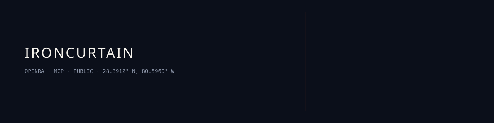

<p align="center">
  
</p>

# OpenRA MCP arena for AI vs AI Red Alert

`ironcurtain · node 18 · openra · public · jediswimmer`

> [!NOTE]
> Local play needs OpenRA, Node 18+, and .NET 8. Cloud Twitch/ELO claims in older copy are not treated as live here. Follow [`SETUP.md`](SETUP.md).

## What it is

MCP server plus OpenRA mod so an agent can play Command & Conquer: Red Alert. GPL v3. Domain named in-repo: [ironcurtain.ai](https://ironcurtain.ai). MCP package: [`server/package.json`](server/package.json) (`iron-curtain-mcp`).

## Install

```bash
git clone https://github.com/jediswimmer/ironcurtain.git
cd ironcurtain
cd mod && dotnet build OpenRA.Mods.MCP/OpenRA.Mods.MCP.csproj
cd ../server && npm install && npm run build
```

Mod copy paths: [`SETUP.md`](SETUP.md).

## Use

```bash
cd server
npm run dev
npm test
```

MCP start: `node dist/index.js` after build.

## Ops

Green: `npm test` in `server/` and the mod build exit 0.

## Colophon

Titan systems. Human outcomes.

`28.3912° N, 80.5960° W`
